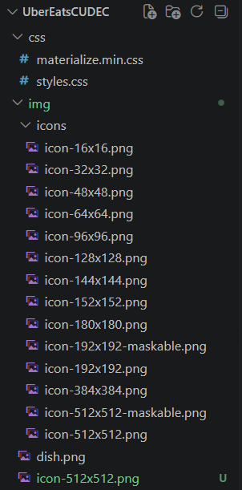
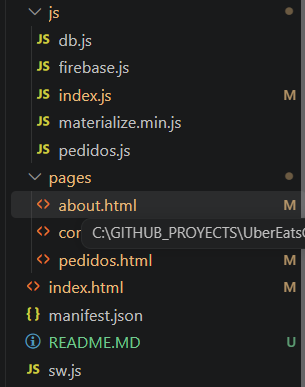
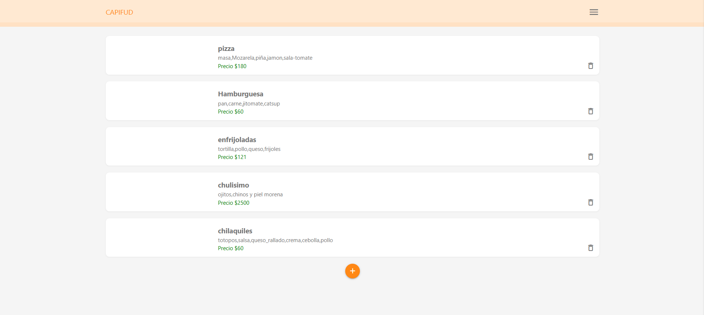

CapiFood

Aplicación tipo **PWA** para pedidos de comida en línea. Proyecto académico desarrollado como parte de la materia *Taller de Progrmacion Avanzada* en la carrera *Ing. sistemas computacionales* por el alumno **Leonardo David Garcia Jimenez**.

Descripción del proyecto

CapiFood es una aplicación web progresiva (PWA) que permite a los usuarios **registrar platillos, realizar pedidos y visualizar su ubicación en un mapa**. Su propósito es simular un sistema de pedidos estilo UberEats/Rappi, resolviendo la necesidad de gestionar menús y órdenes en tiempo real con Firebase.

Objetivos

* **Objetivo general**: Desarrollar una aplicación PWA que permita gestionar platillos y pedidos de manera dinámica, integrando base de datos en la nube y geolocalización.
* **Objetivos específicos**:
  * Implementar un sistema CRUD para platillos.
  * Permitir a los usuarios realizar pedidos con dirección y ubicación.
  * Integrar Firebase Firestore y Storage para datos e imágenes.
  * Usar Leaflet para mostrar la ubicación en tiempo real.
  * Optimizar la aplicación para funcionar offline con Service Worker.

Características principales

* Registro de platillos con nombre, ingredientes, precio e imagen.
* Actualización y eliminación de platillos en tiempo real.
* Realización de pedidos con dirección y ubicación en mapa.
* Menú lateral con secciones: Inicio, Acerca, Contacto.
* Instalación como aplicación móvil gracias al manifest.json.
* Funcionamiento offline mediante Service Worker.

Tecnologías utilizadas

* **HTML5, CSS3, JavaScript ES6**
* **Materialize CSS** (UI/UX)
* **Firebase Firestore & Storage** (base de datos y fotos)
* **Leaflet.js** (mapas y geolocalización)
* **Service Worker & Manifest.json** (PWA)

Estructura del proyecto

Evidencias / Capturas de pantalla

* Pantalla de **Inicio

  
* Formulario para **Registrar platillo**
* Pantalla de **Realizar pedido** con mapa
* Página **Acerca**
* Página **Contacto**

*

Base de datos

* **Motor utilizado**: Firebase Firestore
* **Colecciones principales**:
  * `platillos` → { nombre, ingredientes, precio, foto }
  * `pedidos` → { platillo, dirección, ubicación }

Licencia

Este proyecto fue desarrollado con fines académicos como parte de la carrera *Ing. Sistemas Computacionales*, para la materia *Taller de Programacion avanzada*, del grupo *09isc181* en *Universidad Multicultural CUDEC*.
